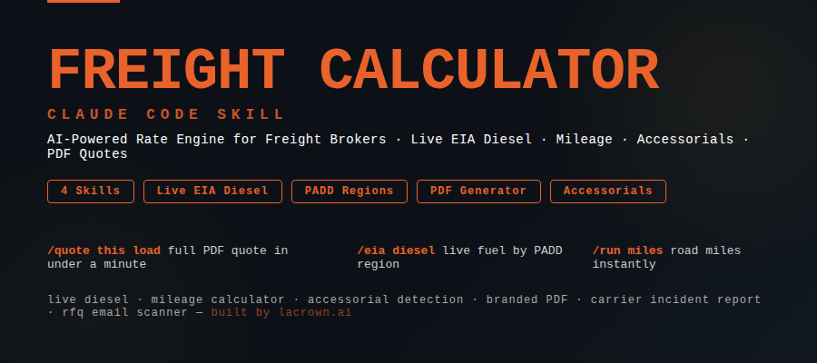

# 🚛 Freight Quote Claude Skills



**Freight Quote Claude Skills for Claude Code.** Generate branded PDF freight quotes with live EIA diesel surcharge, calculate road miles, detect accessorials, document carrier failures, and scan your inbox for RFQs — all from a single command. 4 skills, live government fuel data, no extra subscriptions.

[](LICENSE)
[]()
[]()
[](https://www.eia.gov/petroleum/gasdiesel/)
[]()

---

## Quick Start

```bash
pip install reportlab requests python-docx
```

That's it. Fill in `config/broker_config.json` once with your brokerage info and every quote reflects your brand automatically.

---

## What Is This?

Freight Quote Claude Skills is a complete rate quoting engine built as Claude Code skills. It turns a load description — from an email, a text, or a quick paste — into a professional branded PDF quote with live diesel pricing, calculated miles, and flagged accessorials, ready to send.

Say `quote this load` and Claude reads the SKILL.md, fetches this week's EIA diesel price for the correct region, runs the miles, detects your accessorials, and builds the PDF.

RFQ at 4:18 PM. Quote out at 4:44 PM. Signed rate confirmation at 5:07 PM. **49 minutes. Same hour.**

No DAT subscription. No FreightWaves. No SaaS rate engine averaging everyone else's losses into your quote. Your data. Your history. Your margins.

📺 **[Watch the full build on YouTube](https://www.youtube.com/watch?v=SaVsCUjYa54)**

---

## All 4 Skills

### Quoting & Rate Engine

| Command | What It Does |
|---------|--------------|
| `quote this load` | Full PDF quote — pulls live EIA diesel by PADD region, calculates road miles, detects accessorials, generates branded PDF ready to send |
| `run the miles` | Calculates road miles between any origin and destination. 100 freight hubs built in; geocodes anything else via OpenStreetMap |
| `what's diesel today` | Fetches current week's EIA on-highway diesel price for the correct PADD region. Returns FSC % automatically |
| `quote this email` | Paste any RFQ email — Claude extracts origin, destination, weight, dims, equipment type, and quotes it |

### Documentation & Compliance

| Command | What It Does |
|---------|--------------|
| `start an incident report` | Generates a formal Word doc incident report — load #, carrier info, timeline, violation detail |
| `document this carrier` | Same as above — drafts both a carrier-facing and customer-facing email alongside the report |
| `write up this load` | Full incident documentation package for any carrier failure or service violation |

### Email & RFQ Scanning

| Command | What It Does |
|---------|--------------|
| `scan my inbox for RFQs` | Connects to Gmail, detects rate request emails, extracts load details, drafts quote reply |
| `check my emails for rate requests` | Same — scans for keywords: quote, rate, RFQ, need a truck, pricing for, can you cover |
| `did anyone send me a freight quote request` | Scans last 7 days — returns summary of any RFQ threads found with extracted load details |

---

## Sample Output

### `quote this load`

```
Chad from Machinery Futures needs a Conestoga LTL quote.
Origin: Erie PA 16501
Destination: Fishers IN 46037
Machine: 15'L x 4'W x 7'H, 13,000 lbs
```

Claude produces:

```
FREIGHT QUOTE — Your Brokerage Name
Quote #: YBN-2026-0409
Date: April 9, 2026  |  Valid Until: April 23, 2026

QUOTED TO
─────────────────────────────────────────
Company:     Machinery Futures
Contact:     Chad

SHIPMENT DETAILS
─────────────────────────────────────────
Origin:      Erie, PA 16501
Destination: Fishers, IN 46037
Est. Miles:  ~365 miles
Service:     Conestoga LTL
Commodity:   Industrial Machinery
Weight:      13,000 lbs
Dimensions:  15' L × 4' W × 7' H
Transit:     2–3 Business Days

PRICING SUMMARY
─────────────────────────────────────────
Freight Transportation     Included
Fuel Surcharge             EIA PADD 2 — $5.16/gal — 51% FSC | Included
Accessorial Charges        None anticipated (see terms)

TOTAL FLAT RATE            $2,450.00
All-inclusive | No hidden fees

Saved: Quote_MachineryFutures_Conestoga.pdf
```

### `what's diesel today` — Indiana (PADD 2 Midwest)

```json
{
  "padd": "PADD 2 — Midwest",
  "diesel": 5.16,
  "fsc_pct": 51,
  "fsc_note": "Based on EIA week of 2026-04-07",
  "source": "https://www.eia.gov/petroleum/gasdiesel/"
}
```

### `run the miles` — Fort Wayne, IN → Houston, TX

```json
{
  "origin": "FORT WAYNE, IN",
  "destination": "HOUSTON, TX",
  "road_miles": 1185,
  "display": "~1,185 miles",
  "method": "Geodesic × 1.22 road factor"
}
```

---

## Use Cases

### Solo Freight Broker / Agent
You're quoting 20–100+ loads a day and every quote is a blank doc you fill in by hand. `quote this load` turns that into a 60-second automated process. Live diesel. Real miles. Accessories flagged. PDF out the other end. Done.

### Small Brokerage (2–10 People)
Your team is quoting the same lanes repeatedly for the same shippers. Build customer-specific skills with lane history and accessorial defaults for your top 5 shippers. Every person on the team quotes from the same data — no more inconsistency.

### 3PL / Logistics Operations
You need documentation when carriers fail. The carrier incident report skill generates a formal Word doc with the full timeline, violation detail, and carrier + customer email drafts in seconds. No more starting from scratch every time a load goes sideways.

### Freight Agents Leaving a Carrier
You're going independent and you need a professional quoting system that doesn't cost $500/month. This is free. Fill in your branding once. Quote like a full brokerage on day one.

---

## Why Not Just Use DAT or FreightWaves?

The SaaS rate platforms aggregate thousands of transactions — including every load someone covered at a loss, every accessorial that never got billed, every fuel surcharge based on last month's diesel. All of it averaged together as "market rate."

**You're not benchmarking against success. You're benchmarking against the average of everyone's mistakes.**

This skill pulls your data:
- Live EIA diesel for **this week**, not last month's
- **Your** lane history and actual outcomes
- **Your** customer's accessorial patterns
- **Your** carrier P&L — not the market average

> _"Stop quoting from someone else's losses."_ — [Read the full post](https://lacrown.ai/newsletter/why-i-stopped-trusting-dat-freightwaves-and-truckstop)

---

## Installation

### Prerequisites
- **Claude Code** (with an active Anthropic API key)
- **Python 3.8+** (for PDF generation and scripts)
- `reportlab` — PDF generator
- `requests` — EIA diesel fetch
- `python-docx` — incident report (Word doc)

### Install Dependencies

```bash
pip install reportlab requests python-docx
```

### Configure Your Brokerage

Copy `config/broker_config.json` and fill in your details:

```json
{
  "company_name":   "Your Brokerage LLC",
  "mc_number":      "MC #000000",
  "address":        "123 Main St, City, ST 00000",
  "email":          "you@yourbrokerage.com",
  "phone":          "555-000-0000",
  "brand_navy":     "#0D2D5E",
  "brand_gold":     "#C8A84B",
  "valid_days":     14,
  "eia_api_key":    ""
}
```

Get a free EIA API key at [eia.gov/opendata/register.php](https://www.eia.gov/opendata/register.php) for reliable diesel fetching. Leave blank to use the web scraping fallback.

### File Structure

```
freight-quote-claude-skills/
│
├── README.md
├── LICENSE
├── config.example.json
│
├── skills/
│   ├── freight-quote/
│   │   └── SKILL.md
│   │
│   ├── freight-calculator/
│   │   ├── SKILL.md
│   │   ├── config/
│   │   │   └── broker_config.json
│   │   ├── scripts/
│   │   │   ├── generate_quote.py
│   │   │   ├── eia_diesel.py
│   │   │   └── mileage.py
│   │   └── examples/
│   │       └── sample_payload.json
│   │
│   ├── carrier-incident-report/
│   │   └── SKILL.md
│   │
│   └── rfq-email-scanner/
│       ├── SKILL.md
│       └── scripts/
│           └── scan_rfq.py
│
└── examples/
    └── sample-quote.pdf
```

---

## Live Diesel — PADD Region Reference

| Region | States | Recent Price |
|--------|--------|-------------|
| PADD 1 — East Coast | ME, NH, VT, MA, RI, CT, NY, NJ, PA, MD, DE, DC, VA, WV, NC, SC, GA, FL | $5.48/gal |
| PADD 2 — Midwest | OH, MI, IN, IL, WI, MN, IA, MO, ND, SD, NE, KS, OK, TN, KY | $5.16/gal |
| PADD 3 — Gulf Coast | TX, LA, MS, AL, AR, NM | $5.13/gal |
| PADD 4 — Rocky Mountain | MT, ID, WY, CO, UT | $5.17/gal |
| PADD 5 — West Coast | WA, OR, CA, AK, HI, NV, AZ | $6.31/gal |

_Prices updated weekly from [EIA.gov](https://www.eia.gov/petroleum/gasdiesel/). California currently at $6.87/gal._

---

## Standard Cargo Insurance Clause

Every quote generated by this skill pack includes the following clause automatically — no manual add required:

> **Cargo Insurance:** The carrier selected for this shipment will carry a minimum of $100,000 in cargo insurance. Any cargo value exceeding $100,000 must be disclosed prior to booking. Shipper is responsible for obtaining a shipper's interest insurance policy to cover any value above the carrier's cargo liability limit.

---

## Watch the Build

📺 **[Full video: RFQ to Signed Rate Con in 49 Minutes](https://www.youtube.com/watch?v=SaVsCUjYa54)**
👥 **[Join the La Crown community](https://skool.com/la-crown-ai-8246)**
📰 **[La Crown Blog — Why I Stopped Trusting DAT](https://lacrown.ai/newsletter/why-i-stopped-trusting-dat-freightwaves-and-truckstop)**

---

## Custom Build

This free version gives you the foundation. For a fully custom setup — your specific customers, your lanes, your carrier history, voice agents that quote loads over the phone, CRM sync — visit **[lacrown.ai](https://lacrown.ai)** or email **millisa@lacrown.ai**.

---

## Contributing

Found a bug? Have a feature idea? Open an issue or submit a pull request. This pack is maintained by La Crown Inc. and the freight broker community.

---

## License

MIT — free to use, modify, and distribute.

---

_Built with 26 years of freight experience and a lot of frustration with formatting PDFs at 6am. — Missy_
